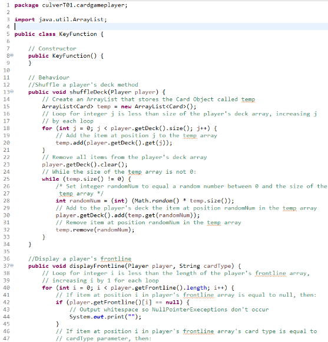
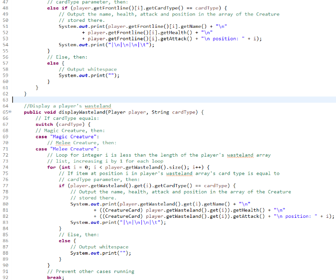
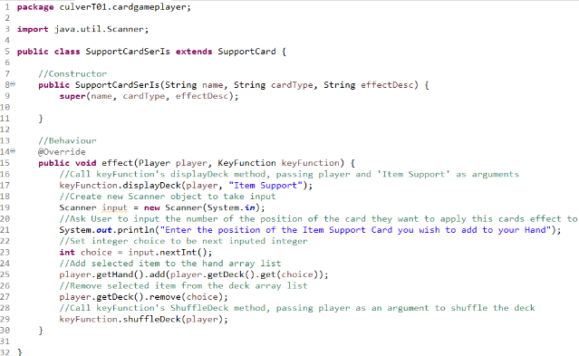

  <h1 class="col align-self-center">Support of Cards</h1>
  

    

    Hello all! 
    This is the third update to the Card Game Player Project and this week I've been finishing the other SupportCard classes. The plan after this is to rework all SupportCard's effect method to be boolean rather than void, as I need to be able to take into account whether or not the Support Card's effect can go through because there's an appropriate target for the effect. Also make the skill attribute that CreatureCard has an attribute of Card instead, so powerful Support Cards can also be restricted. 
    As always, the entire project is available at this GitHub repository: <a href="https://github.com/CulverT01/cardgameplayer">https://github.com/CulverT01/cardgameplayer</a>
    

  

  

    <h2 class="row">Updates</h2>
    
 
    I have created and tested all of the Support Card classes' behaviour methods, so you can now: Increase a Creature's Health, Increase your Defence Points, Play a Magic/Melee Creature from your Wasteland, Place a Magic/Melee Creature at the bottom of your Deck, Search for Magic/Melee Creature, and Search for an Item/Magic Support Card.  
    There is also a new class called KeyFunction that will store methods that are frequently used, such as displaying Frontlines, Wastelands, etc as well as a method to shuffle the decks after they have been through. The display methods are just the for loops seen on the Support Card's methods, which goes through each item in an array/ArrayList and outputs their Name, Attack and Health (if a Creature Card) or Effect Description (if a Support Card) and the Item's position in the array/ArrayList, if the item's cardType is equal to a String value called cardType that will be equal to one of the 4 card types (Magic Creature, Melee Creature, Item Support, Magic Support).  
    The shuffleDeck method creates a temporary ArrayList called temp, loops through a player's deck and adds each item to temp, before then clearing the player's deck. It then runs while loop that finishes when the size of temp is 0 and adds the item at a random index in temp to the player's deck, before removing said item from temp.  
    The reasons for the class' creation is in the Changes and Clarifications, while KeyFunction class and SupportCardSerIs class are shown below.
    

    

    
    
    
    
    
    

  

  

    <h2 class="row">Changes and Clarifications</h2>
    

    In order to make my life easier, I have changed SupportCard1 and SupportCard2 classes, so they include an integer attribute called strength, which will be the number that card's effect increases the attack of a Creature. This also applies to other SupportCard classes (SupportCardHthIncMag, SupportCardDefInc, etc) that will use a number as a part of their effect, so one class can represent 2 or 3 Support Cards rather than 1. I have also changed their names to SupportCardAtkIncMel and SupportCardAtkIncMag respectively for the same reason as strength's addition.   
    The creation of the KeyFunction class is so I don't have to code a for loop that displays Cards based on their card type and not worry about shuffling the decks when I am building the runner as the other time I will need to shuffle decks will be before a game starts. I have not used the clone method, that ArrayLists have, in the shuffleDeck method because I was not confident that Card objects stored in the player's deck would still work as intended. This is because the clone method creates an shallow copy of the ArrayList, meaning that the items stored are not copied, but instead the clone array has references to the original objects in the list. If the clone method would work as the for loop currently used and my fears are misplaced, please do let me know via the Contact page of this website.
    

  

