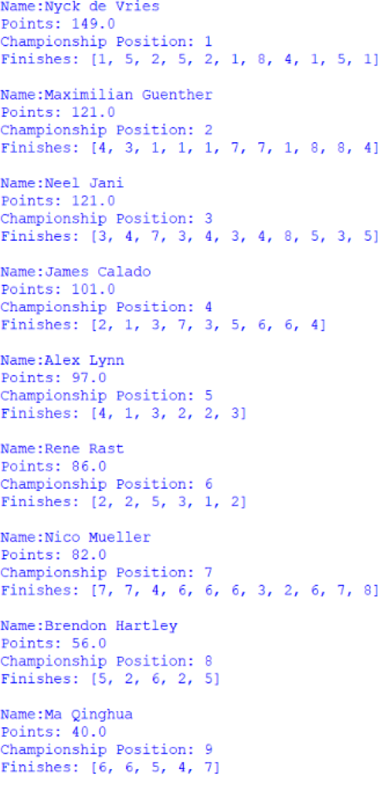
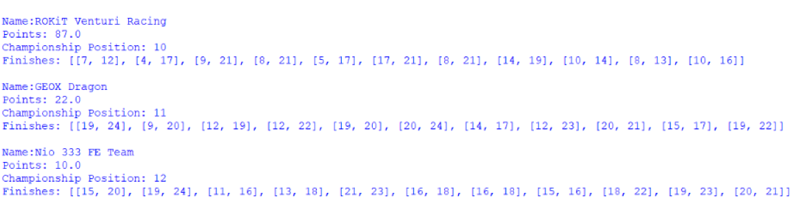

  <h1 class="col align-self-center">Quick Six</h1>
  

    

    This is my eleventh update to my Alternative Formula E Points Format project. This season was the complete reverse of last season as it is dominated by 1 driver who sealed the title the earliest anyone has up to this point. Season 6 is noted for 2 other things: the 6 race finale in Berlin brought on by the Covid-19 Pandemic in 2020 which gave some teams excuses to drop underperforming drivers (Abt and Nio) and some drivers excuses to drop underperforming teams (Brendon Hartley and Pascal Wehrlein) and introducing a bonus point for setting the fastest lap during the group stage of qualifying, bringing the maximum points total to 30 (25 for the win, 1 for fastest lap of top 10 finishers, 3 for pole position, 1 for being the fastest in the group stage part of qualifying). Another thing note as well is that the winner of each of the last 4 races was 8th in the standings going into the race and moved up to 2nd in the standings after their win. 
    As always, all files and documents are found in the GitHub repository: <a href="https://github.com/CulverT01/altfepointsformat">https://github.com/CulverT01/altfepointsformat</a> 
    Please note that I have removed the username and password for the database from the admin program in the interest of security, but not from the viewer program as the user signed on there has read only permissions.
    

  

  

    <h2 class="row">Results</h2>
    <h3 class="row">Overall Drivers' Championship</h3>
    
 
    Antonio Felix da Costa wins the championship both in real life and under the alternative format with points totals of 158 and 149 respectively as well as with 2 rounds to spare in both championship formats. 2nd place goes to Sebastien Buemi, who finishes with 103 points but he does not finish there in real life as he finishes in 4th with 84. 2nd place in real life goes to Stoffel Vandoorne who finishes with 87 points, but under the alternative format he finishes 4th with 97 points. Antonio's advantage over the rest of the field looks great because he is the only one who puts up title-contending form as his points total would be enough for him to win the season 1 title (the only other season with 11 races), while Sebastien would finish 7th in that season with his points total. 
    Only Antonio scores less points under the alternative format compared to real life (a gap of only 9 points), with the only one who ties with their real life total is Ma Qinghua as he never finishes higher than 16th and achieves this result once. The driver who gains the most points compared to their real life total is Edoardo Mortara, who consistently finishes races to achieve 67 points which is a difference of 26, compared to his real life total of 41. 
    The drivers who gained the most positions compared to their final standings under the current format is Lucas Di Grassi, who gains 3 places to finish 3rd under my alternate format with 100 points respectively compared to 6th and with a points total of 77. The driver who loses the most positions compared to where they finished under Formula E's current format is Jean-Eric Vergne who falls 4 places to finish 7th; scoring a points total of 90. This compares to real life where he finishes 3rd with 86 points. Jean-Eric probably has one of the worst title defences the championship will ever see as, while others can claim extenuating circumstances for their poor performances, what does Jean-Eric have? His teammate won the championship, so it's certainly not the car and his team is manufacturer-backed, so there's not like there's a lack of resources there either. Another disappointing driver is Max Guenther as at this point of his career, he has as many top 5 finishes as he has top 10 finishes (5), despite being is solid midfield equipment. We do have a new winner for the lowest classified finisher, as Ma Qinghua takes the unenviable record with a 23rd finish in the Marrakesh ePrix, but he finishes 1 lap down as he is a slow driver in a slow car. He finishes 1 lap down in all but 2 races as he fails to finish one of them and the other he is on the lead lap, but is 1 minute and 28.165 seconds of the winner. 
    Below are the overall Drivers' Championship standings: 
     
     
     
     
    

    <h3 class="row">Customer Trophy for Drivers</h3>
    

    The championship is won by Edoardo Mortara who beats Sam Bird 171 points to 158. While Sam is in the faster machinery and scores more points in the overall championship, he has 1 more retirement than Edoardo and Edoardo is consistent enough that if he is behind Sam in a race, he is only 1 place behind, so Bird can only pull at most 3 points and thus loses the game of inches that the championship becomes. A driver you would expect to be a factor is Robin Frijns, but he suffers 3 retirements, 1 disqualification, and 1 non-start, which all add up (or rather don't) to a 4th place finish behind a struggling Felipe Massa. All drivers win the class multiple times, with an almost even share amongst the drivers as all but Felipe win the class 3 times. 
    Below are the Customer Trophy for Drivers standings: 
    
    

    <h3 class="row">Nelson Piquet Jr Trophy</h3>
    

    The winner of the Trophy is Nyck de Vries who scores 149 points over Max Guenther and Neel Jani, who tie on 121 points and Max taking it on countback courtesy of 4 wins to 0. Max's 4 wins means he sets the record for most class wins in a season that doesn't result in a trophy (previous was Andre Lotterer in season 4 with 3), is tied all-time for class wins with Robin Frijns (6) and wins the class the most times consecutively since Robin won it 4 times in a row back in season 2. A good description of how Max choked the trophy away is by looking at the results from the Berlin Finale: Max scored 33 points across those 6 races (1 win and a 4th place), while Nyck scored 84 points (3 wins, a 4th place and a 5th place). Another record that is broken is number of Nelson Piquet Jr Trophy class starts without a class win, as an overall finish of 11th in the 2nd Berlin ePrix, Alex Lynn finally wins the Nelson Piquet Jr Trophy class after 22 starts. The new holder is Gary Paffett, who has 13 starts without a class win. 
    Below are the Nelson Piquet Jr Trophy standings: 
     
     
    

    <h3 class="row">Overall Teams' Championship</h3>
    

    DS Techeetah win their 2nd ever teams title both in real life and under the alternative format with points total of 244 and 225 respectively. 2nd place under both points format is Nissan e.dams who score 167 points in real life and 194 under the alternative format. This means Techeetah must wait until the final round to take the title, but it is never in doubt as they lead the teams' standings from their first win of the season. Techeetah are the only team this season to: score less points under the alternative format and have both their drivers in the top 10 in the driver standings at the end of the season. There is a slight change regarding finishing position between the 2 points formats as Audi Sport Abt Schaeffler Formula E Team finish 4th under the alternative format, moving Envision Virgin Racing and BMW i Andretti Motorsport down a place (5th and 6th respectively). While GEOX Dragon and Nio 333 FE Team have spent the last few seasons as backmarkers, this season takes the cake as the 2 teams have 1 top ten between them - a 9th place achieved by Brendon Hartley in the 2nd Diriyah ePrix after post-race penalties get applied, so didn't even see the chequered flag in the top 10 anyway. 
    Below are the overall Teams' Championship standings: 
     
     
    

    <h3 class="row">Customer Teams' Championship </h3>
    

    As their first season as a customer team, ROKiT Venturi Racing win the Customer Teams' Championship with a round to spare and a points total of 196. The deciding factor is simple: Venturi never had a race where it did not score points for this championship, Envision Virgin Racing has 2 (Diriyah ePrix 2 and Mexico City ePrix). The good news for Virgin is that they won more races than Venturi, 6 races compared to 5 races respectively, so can take some solace in that. 
    Below are the Customer Teams' Championship standings: 
    
    

    <h3 class="row">Manufacturers' Cup</h3>
    

    After coming up agonisingly short the last 2 seasons to Audi, DS Automobiles finally win that elusive Manufacturers' Cup with points total of 241 over Nissan in 2nd who finish with 212 points. DS Automobiles would also finally win the Manufacturers' Cup with 227 points if it had been run in Season 6, but unlike the teams' and drivers' it must wait until the final round. Audi would finish 2nd with 215 points and are the only team to score less points under the alternative format as their 2 teams (Abt and Virgin) can achieve top 10 results quite easily and consistently. The differences between the 2 final standings are that Audi swap places with Nissan to finish 4th under the alternative format and Jaguar beat out Porsche for 6th under the alternative format, but lose out in hypothetical real life. 
    Below are the Manufacturers' Cup standings: 
     
     
    

  

