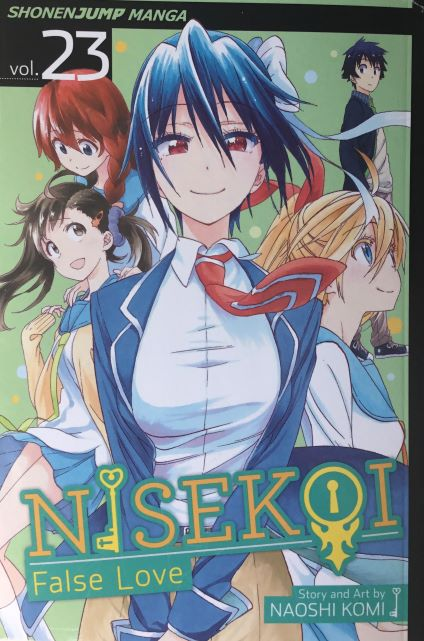

  <h1 class="col align-self-center">Nisekoi Volume 23 - One Day</h1>
  

    
  
        

            

            <h2 class="accordion-header" id="headingOne">
                <button class="accordion-button" 
                    type="button" 
                    data-bs-toggle="collapse" 
                    data-bs-target="#collapseOne" 
                    aria-expanded="true" 
                    aria-controls="collapseOne">
                    Introduction
                </button>
            </h2>
                

                    

                    This is my review of Volume 23 of Nisekoi and for the first time since Volume 1 we have a different number of chapters than what is normal. This time we have 10! Also we are entering the final arcs for some characters as they come to terms with their feelings, but they are not getting the grandiose arc that Marika had.
                    

                

            

            

            <h2 class="accordion-header" id="headingTwo">
                <button class="accordion-button collapsed" 
                type="button" 
                data-bs-toggle="collapse" 
                data-bs-target="#collapseTwo" 
                aria-expanded="false" 
                aria-controls="collapseTwo">
                Chapter 198: Coincidence
                </button>
                </h2>
                

                    

                   Chitoge is annoyed that she has to see Raku, so asks him to sit further away. Raku decides to order his usual ramen, tonkotsu ramen, but sees that the restaurant is offering a new miso ramen and orders that instead. Unfortunately, Chitoge is also ordering some miso ramen and orders at the same time as Raku, which infuriates both. They both finish eating and wish to pay at the same time (don’t worry, Chitoge ordered a lot more so she didn’t eat slower on purpose) which just adds to their respective aggravation. They leave together and go their separate ways, only to meet up in various places. At the train station (the final place they meet in this sequence) Chitoge demands that Raku goes home first so they stop running into each other, but an accident on the train line means there is a delay. The 2 once again go their separate ways to kill some time and end up meeting each other at an amusement arcade. The 2 break down into laughter rather than going for each others throats, before both apologise for their behaviour earlier in the day. They decide to continue the date they were on at the arcade, trying out various games, culminating in at hotly contested game of air hockey (paying for all the games played today is at stake) that ends in a tie. The chapter ends with Chitoge bashfully suggesting they do a photo sticker booth next.
                    

                

            

            

            <h2 class="accordion-header" id="headingThree">
                <button class="accordion-button collapsed" 
                type="button" 
                data-bs-toggle="collapse" 
                data-bs-target="#collapseThree" 
                aria-expanded="false" 
                aria-controls="collapseThree">
                Chapter 199: Real Love
                </button>
                </h2>
                

                    

                    Raku is initially hesitant, but caves in after seeing how persistent Chitoge is. They choose the couple mode and for the first photo, they need to pose where Raku hugs Chitoge from behind. Raku is willing to not do it, but Chitoge is insistent, so they do so. They receive more prompts, which they complete without issue, one of which is to pull some funny faces and Chitoge initially struggles as she wishes to at least remain cute. Raku tells her that he’s seen her look ridiculous before, which convinces her to drop her guard and pull a really funny face, which unfortunately for her is captured by the booth. After leaving the booth, Chitoge remarks that Raku looks happier and explains that the point of this date was to uplift Raku’s mood and she likes cheery bean sprouts not wilted ones. Embarrassed at what she said, Chitoge leaves to get them some drinks and Raku is left alone to contemplate how he sees Chitoge. His opinion has sort of shifted from ‘a good friend’, as he sees her differently from his other friends, but what that is he never gets to as Chitoge return with the drinks. She hands him a soda as she assumes he is still on his soda kick. They move onto a dance arcade game which the 2 have played before, but never beaten the final level and Chitoge is determined to change that. Whilst playing the game, Raku remembers various times he was with Chitoge and realises how he feels about her: he is in love with her.
                    

                

            

            

            <h2 class="accordion-header" id="headingFour">
                <button class="accordion-button collapsed" 
                type="button" 
                data-bs-toggle="collapse" 
                data-bs-target="#collapseFour" 
                aria-expanded="false" 
                aria-controls="collapseFour">
                Chapter 200: Realization
                </button>
                </h2>
                

                    

                    Now that Raku knows that he is in love with Chitoge, he starts acting awkward around her. He continues to agonise over it and soon realises that his love may be unrequited as Chitoge is in love with someone. Chitoge remarks that they have a year left of their fake relationship left and that she will miss it a bit. This prompts Raku asks Chitoge what her crush is like to see what he is up against. Chitoge explains that here crush is an idiot, insensitive, bossy, and a total busybody, but is also a good person. Raku asks if she is an hurry to end the fake relationship and Chitoge isn't. This confuses Raku and he begins to think about it which causes the penny to drop, but we don't see the penny land (if you know what I mean) as Chitoge leaves. 
                    Raku explains his recent discovery about his feelings to Shu, who is totally ok with Raku being in love with 2 girls. Raku isn't, as he believes that he is betraying Kosaki (dude, you were never hers to begin with). Shu comforts him by telling him that he isn't a bad person, provided he makes decision on which girl to go for - remember no harems allowed in this harem series. Raku then resolves to work out who he truly is in love with, as he hasn't got long left (I know it is a year, but we have 2 more volumes after this).
                    

                

            

            

            <h2 class="accordion-header" id="headingFive">
                <button class="accordion-button collapsed" 
                type="button" 
                data-bs-toggle="collapse" 
                data-bs-target="#collapseFive" 
                aria-expanded="false" 
                aria-controls="collapseFive">
                Chapter 201: Spring Breeze
                </button>
                </h2>
                

                    

                    Haru and her classmates have been handed a future career questionnaire which she is unsure how to answer. All of her friends, including Fu, suggest she goes into Japanese sweets making but Haru isn't so sure as she doesn't find it enjoyable any more and hasn't since last year. Fu assumes it is because Raku, which Haru denies, but Fu is correct.  
                    At home, Haru asks her sister for advice, but it turns out Kosaki is at a similar point and her deadline is a lot closer, so is of no help. Kosaki advises Haru to asks Raku, as conveniently he is helping at the shop the next day.  
                    Raku is treating today like his earlier date with Chitoge - a way to gauge how he feels about Kosaki. He is absolutely smitten with her and their flirting unsettles Haru, who takes her break to get way from them. Raku enters the break room to ask how Haru is feeling, because to him, she is feeling down. Haru refuses to tell him anything and asks why he isn't spending time with her sister - you know: his crush. Raku explains that he wants her opinion on some Nerikiri, which are Japanese sweets made from rice dough and bean paste that are the epitome of Japanese sweets (source: Raku Ichijo). The reason for wanting Haru's opinion is that he wants someone who is good at making Japanese sweets to critique them.<i> I assume he hasn't asked Nanako (Haru and Kosaki's mother) is that she would probably interpret as a way trying to get her blessing for his and Kosaki/Haru's marriage, which she would already give based on her reaction the first time she had his Japanese sweets.</i> Haru tastes the sweets and gives some useful feedback, but soon realises that she still is in love with Raku and attempts to leaves the break room, only for her mother to burst in with Kosaki and announce that Raku, Kosaki and Haru are going to enter the Bonyari Japanese Confection Contest.
                    

                

            

            

            <h2 class="accordion-header" id="headingSix">
                <button class="accordion-button collapsed" 
                type="button" 
                data-bs-toggle="collapse" 
                data-bs-target="#collapseSix" 
                aria-expanded="false" 
                aria-controls="collapseSix">
                Chapter 202: Important
                </button>
                </h2>
                

                    

                    Nanako explains that three have to enter as the competition is only open to minors and victory (which is assured) will bring a lot of publicity to the shop. Nanako nominates Haru to be the team leader as she has a lot of experience making Japanese sweets and can cook. The plan is to make a high-grade fresh Mochi and bean-paste cake that uses a cherry blossom motif (it is spring and Japanese sweets must tie into the current season). Haru orders her sister to make the decorations and Raku to the dough, while she will make the sweet bean paste. Haru gets her sister to taste her paste and it's good but not perfect, then Raku asks for his dough to be tasted and it is perfect according to Haru. Seeing how perfect Kosaki and Raku are together, distracts Haru and she lets her paste burn and ruins it. The are no more ingredients for the bean paste, so Haru is at a lost on what to do but Kosaki has an idea to combine the Uguisu Soy flour and sweet rice flour to make Uguisu Mochi dough (Uguisu Mochi represents Spring) and they can accent it using salted cherry blossoms, adapting cakes that Kosaki's father made based on mustard blossoms.  Seeing how in sync the other 2 are, Haru leaves despite Raku still needing her as he wants to know how much sugar he will need. Haru is hiding outside the competition hall self-loathing after her failure to be a proper team leader and expert at Japanese Sweets, when Raku finds her, Haru explains that he and Kosaki don't need her and Raku asks if she's upset and she confirms it. Raku replies that he probably wouldn't have got so upset (just what an emotional wreck like needed to hear) before clarifying that he means he doesn't care enough about Japanese sweets to get upset over something like this, so Haru must really care about Japanese sweets to get like this. To try and lift her mood, Raku mentions that Haru's Prince Charming likes her sweets so Haru tells the truth that she knows that Raku is her Prince Charming.   
                    

                

            

            

            <h2 class="accordion-header" id="headingSeven">
                <button class="accordion-button collapsed" 
                type="button" 
                data-bs-toggle="collapse" 
                data-bs-target="#collapseSeven" 
                aria-expanded="false" 
                aria-controls="collapseSeven">
                Chapter 203: Beginning
                </button>
                </h2>
                

                    

                    Haru explains how she knows that Raku is her Prince Charming (her sister told her) and that he kept it hidden to protect her feelings. She also apologises for past tsundere behaviour, despite still exhibiting tsundere behaviour - it's not like she likes him or anything: idiot! Haru also reveals that she knows that Raku and Chitoge's relationship is fake, but not because of Kosaki telling her. She tells him to treat her sister right and that she won't get mad when he approaches Kosaki and actually she has been helping by putting them on dates together, so Raku should make his feelings clear. They return to the competition hall, where Kosaki is a loss on what to do and it transpires that Raku wasn't any better, so Haru takes charge like the team leader she is and explains what they need to do, which the others are very much appreciative of. 
                    Much to Nanako's delight, the 3 win the contest and later Haru explains to Fu that she is choosing Japanese sweets-making as her future career path, also she was in love the whole time but never told her due her strong feelings towards him. <i>(The Viz media translation is also weirdly worded)</i> 
                    Even later still, Haru asks to meet up with Raku for some feedback on some sweets she has made and when she arrives, she has a new haircut, which has been chosen as hse will be working with food in her future and has an apprenticeship lined up with Japanese sweets maker that her father knows. Raku asks if he can compliment her looks and is given the go-ahead, so he explains that her new look makes look more grown-up. Raku tastes Haru's sweets and gives detailed positive response, but Haru can't stay long (she is working at her family's shop) so her leaving remark is that she is going to make such delicious sweets that Raku is going to so jealous of them. Then, for old times sake, a gust of wind exposes Haru's underwear to Raku who decides to comment, but Haru prevents him from finishing by the use of force.
                    

                

            

            

            <h2 class="accordion-header" id="headingEight">
                <button class="accordion-button collapsed" 
                type="button" 
                data-bs-toggle="collapse" 
                data-bs-target="#collapseEight" 
                aria-expanded="false" 
                aria-controls="collapseEight">
                Chapter 204: Chance
                </button>
                </h2>
                

                    

                    Obviously Haru isn't the only one who received a future career questionnaire as Paula got one and is showing it to Seishiro. Paula has listed universities and colleges as her next step in her future, although she is embarrassed about it. Seishiro remarks that future plans for them aren't going to be necessary, as they will go where Chitoge goes but Paula is convinced they will be if one wishes to marry the heir to a Yakuza crime family. Claude then calls and tasks Seishiro to do some surveillance on the happy couple he despises - Raku and Chitoge. Seishiro is convinced that such measures are no longer necessary, as she believes that they are a real happy couple in love. She still continues to follow them and notices that they are trying sneak away from something, so continues to follow them, knowing full well she may be encroaching Chitoge's privacy. The couple stop deep inside a park and announce their surprise in seeing members of their own respective organisations (they weren't fighting which is nice). The also mention that no one has realised that their relationship is fake both between the organisations and at school (ignore the people at school who have: Marika, Yui, Shu, etc). This information is a shock for Seishiro who comes out of her hiding spot to confront them about it. The 2 explain themselves and Seishiro accepts it as she is more annoyed at herself for not noticing, she then asks if they have any feelings towards each other, to which they deny.  
                    This new set of information weighs on Seishiro's mind as while she isn't convinced that there aren't feelings involved between the 2, but Raku is single and free to be dated which is music to Seishiro's wing-woman's ears - Paula.
                    

                

            

            

            <h2 class="accordion-header" id="headingNine">
                <button class="accordion-button collapsed" 
                type="button" 
                data-bs-toggle="collapse" 
                data-bs-target="#collapseNine" 
                aria-expanded="false" 
                aria-controls="collapseNine">
                Chapter 205: That's It
                </button>
                </h2>
                

                    

                    Seishiro has come to school in the female school uniform as a way to go on the charm offensive and win Raku’s heart. This is all according to Paula’s plan, however Seishiro is less enthused about it as she can’t simply flip a switch and start flirting with Raku and besides, even if the relationship is fake, there would be trouble for Chitoge if her bodyguard started making moves on her man, so any plan of attack should wait until they graduate. Coincidentally, Raku and Seishiro are on classroom duty, so they have to spend most of the time together and after Seishiro gets dusty after sliding up some stairs (guess why) Raku attempts to dust her down only to get whacked. 
                    Later, while looking after the animals in the school menagerie, Seishiro comes to a realisation the way she acts and feels (both emotionally and physically) might mean she is in love, which shocks her. 
                    They run out of pet food for Margarita, so Raku goes out to get some more and Seishiro accompanies him. She still continues to agonise over whether or not to go after Raku, with her imagination distracting her enough that she injures her ankle. Raku carries her back to school and uses the time to apologise on both his and Chitoge’s behalf for lying about their relationship. Seishiro has already accepted it and instead apologises for being a nuisance which Raku disagrees with as he believes that Seishiro has always a help rather than a hindrance. Seishiro then changes the topic of the conversation to love as her ‘friend’ (read: herself) thinks she is love but isn’t sure. Her ‘friend’ has been noticing a guy a lot as in she always looking at him, her heart races when talking to this guy as well as getting weird around him, and thinking about him causes her to feel a whole range of emotions. Raku determines that her ‘friend’ is in undoubtedly in love.
                    

                

            

            

            <h2 class="accordion-header" id="headingTen">
                <button class="accordion-button collapsed" 
                type="button" 
                data-bs-toggle="collapse" 
                data-bs-target="#collapseTen" 
                aria-expanded="false" 
                aria-controls="collapseTen">
                Chapter 206: One Day
                </button>
            </h2>
                

                    

                    Raku ask if Seishiro agrees and she does. Now knowing that she was in love, Seishiro is at peace with her feelings, but still at crossroads about whether not to confess her feelings. She decides to ask Chitoge how she feels about Raku. Her initial response is that she doesn’t have any feelings towards him, but immediately reveals the truth. Seishiro is not surprised and wishes for Raku to return Chitoge her feelings. 
                    The next day at school, Raku is waiting for Chitoge as she in a meeting with her teachers about her future when Seishiro enters the classroom he is in. Seishiro lets Raku know that her ‘friend’ is thankful for the advice he provided and she has message from them for Raku as well. Seishiro places her hands over Raku’s ears so he can’t hear her confess her feelings of love to Raku, whilst acknowledging that she cannot have him without hurting Chitoge, which is something she could never do. She also assures him that if she ever finds a guy like him, then she will allow herself to fall in love with him and she thanks Raku for teaching her about love. She removes her hands from his ears and suggests that they meet up with Chitoge.
                    

                

            

            

            <h2 class="accordion-header" id="headingEleven">
                <button class="accordion-button collapsed" 
                type="button" 
                data-bs-toggle="collapse" 
                data-bs-target="#collapseEleven" 
                aria-expanded="false" 
                aria-controls="collapseEleven">
                Chapter 207: University
                </button>
            </h2>
                

                    

                    Ruri is awoken by a nightmare which involves her marring Shu. This puts her in a foul mood, especially towards Shu, who she takes down at the first moment she gets. This display of over-aggressive violence has Kosaki concerned, so asks Ruri, who just explains that Shu needs constant violence as a punishment for being a creep and a scum of a human being. Kosaki is still concerned for Shu's wellbeing, but this betrayal angers Ruri, Kosaki backs down. Ruri changes the subject and asks when Kosaki is going to do something about her love life to which Kosaki reveals she has chosen a day in which she will confess her feelings, but can't which day that is right now. Kosaki then changes the conversation topic to be about Ruri's love life and mentions that Ruri and Shu would be a great couple. This really annoys Ruri, so much Kosaki hides out fear being hurt. 
                    After school, Ruri is at a book store buying study materials for Kosaki when Shu makes his existence known by recommending a study guide for those intending to enter Kichiri University. She tries to brush him off, but seeing his face reminds of her nightmare from last night and thus needs to exorcise some of demon by the way of violence against him. Shu is curious as to why Ruri is so eager to be violent towards him, so deduces that it must her time of the month, which causes her to punch him. Unfortunately for Ruri, Shu is still conscious and still trying his luck, but the threat of violence sees him back down - look, he is learning! She asks how he knows that she is applying for Kichiri University and he reveals that he is also planning on going there, so she prepares to strike again, but he somehow convinces her not to. They leave the book shop together, much to Ruri's annoyance, where Ruri reveals that she doesn't like those who don't take things seriously (e.g Shu) but Shu assures her that he is: after all he is tutor. Ruri is convinced he is doing to hang out with younger girls and he admits that is a perk, so she responds appropriately. Ruri warns him that she plans on beating him academically by the time they graduate, so he promises to perform academically as if she beats him academically, she won't beat him physically - Just Kidding! Ruri socks Shu and recommends that he applies for different university. Shu assures her that even if they go to the same university, they are unlikely to meet as they will be in different programs as he will be in education and she will be in Languages. The prospect that Shu could become a teacher causes Ruri to ask if he still has a crush on Ms Kyoko (their old home-room teacher before Yui), but before he can give an answer, a lost child speaking english appears! 
                    The bonus comic details a few interactions that Seishiro and Marika had during their 2nd year at high school, which all involve Seishiro coming to Marika's aid to which Marika duly repays Seishiro for. 
                    

                

            

        

    

    

    

  

