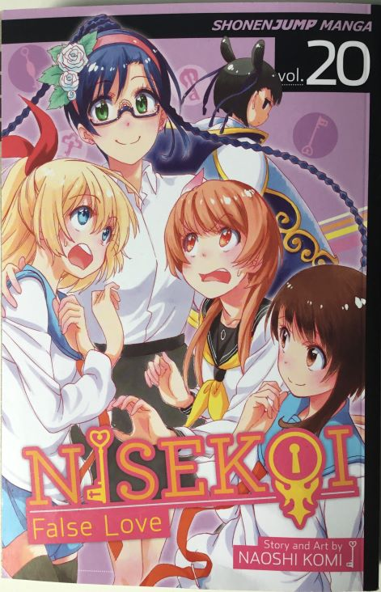

  <h1 class="col align-self-center">Nisekoi Volume 20 - Order</h1>
  

    
  
        

            

            <h2 class="accordion-header" id="headingOne">
                <button class="accordion-button" 
                    type="button" 
                    data-bs-toggle="collapse" 
                    data-bs-target="#collapseOne" 
                    aria-expanded="true" 
                    aria-controls="collapseOne">
                    Introduction
                </button>
            </h2>
                

                    

                    This is my review of Volume 20 of Nisekoi, which makes it, certainly at the time, Shonen Jump's longest running romantic comedy and I have yet to find any evidence to the contrary. Also I haven't finished reviewing this series, we have 5 more volumes left to go.
                    

                

            

            

            <h2 class="accordion-header" id="headingTwo">
                <button class="accordion-button collapsed" 
                type="button" 
                data-bs-toggle="collapse" 
                data-bs-target="#collapseTwo" 
                aria-expanded="false" 
                aria-controls="collapseTwo">
                Chapter 171: Heart
                </button>
                </h2>
                

                    

                    Marika wakes up next to a fire with a shirt draped over as Raku has rescued her. He has noticed that Marika acts extra chipper when she’s not 100% and over-exerting herself and he is only angry at himself for noticing earlier. Raku then asks what Honda meant by that Marika doesn’t have much time, but Marika refuses to explain and Raku respects her wishes. Raku then asks how she’s feeling and Marika gives a positive answer and Raku is not surprised given how long she slept. This worries Marika as they may miss the first sunrise, but Raku is apprehensive about her travelling across the island to see the sunrise (they are in the west side obviously). He finally relents and agrees to take her there but he has to carry her. On the way to the eastern side of the island, Marika explains why she fell in love with Raku as he was the one who changed her and that all throughout difficult parts of her training to be the ideal wife, the love for Raku is what kept her going. The honest outpouring of feelings makes Raku concerned about how to respond. They arrive on the other side if the island and see the first sunrise of which both are grateful to each for allowing this to happen. The 2 then spot Honda on a speedboat, who has come to rescue them. 
                    They return Japan and immediately have to take blood tests (you never know what might be crawling in island jungles) and when Marika is separated from Raku, Honda takes the time to apologise for her actions which will include informing Marika’s mother.
                    

                

            

            

            <h2 class="accordion-header" id="headingThree">
                <button class="accordion-button collapsed" 
                type="button" 
                data-bs-toggle="collapse" 
                data-bs-target="#collapseThree" 
                aria-expanded="false" 
                aria-controls="collapseThree">
                Chapter 172: Prayers
                </button>
                </h2>
                

                    

                    It is time for the first shrine visit of the new year and everyone (except Marika) is here. If you are wondering about Ruri, then she is currently the period of mourning known as Mochu, so it is fine for her to visit. The main topic of conversation is what to ask the Gods for and Kosaki reveals privately to Chitoge that she is going to ask Gods to give her courage to ask out her crush as she has made some progress over the last year and wants to clear that final hurdle. Chitoge then remarks that the progress that she has made with her crush has amounted to referred to as a ‘close friend’. Kosaki reassures her that is good as most people don’t usually refer to someone as a close friend - even of the same sex. The 2 are called over as everyone is going to pray. After everyone prays, Raku heads to the toilet while everyone else goes and gets some Amazake - a non-alcoholic drink made from fermented rice that is served warm, the western equivalent would be mulled wine.
                    

                

            

            

            <h2 class="accordion-header" id="headingFour">
                <button class="accordion-button collapsed" 
                type="button" 
                data-bs-toggle="collapse" 
                data-bs-target="#collapseFour" 
                aria-expanded="false" 
                aria-controls="collapseFour">
                Chapter 173: Transformation
                </button>
                </h2>
                

                    

                    The chapter begins with 2 4-panel bonus manga which detail Paula and Seishiro both drawing fortunes and displeased with the results. 
                    Raku returns from the toilet, only to be confronted by a wobbly Chitoge who demands to know what he means by ‘close friend’. Raku is confused by this behaviour, but Shu finds a nearby paper cup that smells like Amazake, which means Chitoge and the others are drunk - fun times are about to be had. Raku flees, but is caught by Kosaki whose clothes are already coming off. Raku then spots Haru and calls out to her to help dress her sister, but she is drunk too and begins to hug him and demands that he hold her. Kosaki also joins in hugging Raku, so slips out of their hold and runs away and meets a drunk Yui on a bench. Yui begins lecturing Raku about how life is like a pot sticker as you have a wrapper and a filling (no further explanation is given). Seishiro appears behind him, so he dashes off and finds Fu and Paula who are not affected by the Amazake (Paula finds it disgusting). Raku hugs Paula as he has found another survivor, but immediately runs off as he spots a chasing Seishiro and leaves Paula at the mercy of Seishiro. Raku eventually runs into Chitoge as well as the others that have been chasing him and Chitoge asks if he wants to get 'kah-razy' before all 4 collapse. 
                    Later, the girls wake up at the temple, but have no recollection of what happened and assume that what happened was similar to last year. Meanwhile Shu was caught by Ruri and had to endure a mega-lecture from her.
                    

                

            

            

            <h2 class="accordion-header" id="headingFive">
                <button class="accordion-button collapsed" 
                type="button" 
                data-bs-toggle="collapse" 
                data-bs-target="#collapseFive" 
                aria-expanded="false" 
                aria-controls="collapseFive">
                Chapter 174: There Is Someone
                </button>
                </h2>
                

                    

                    It is January 6th 2015 (which means the story began in spring 2013 and events involving the pendant took place in 2003) and is the day for Raku and Chitoge’s first official date of the year. Chitoge is determined to make sure that this date is different and has a plan for the entire day. She takes Raku to see an Animal film (Meowser: Operation Las Vegas), but falls asleep 15 minutes in despite trying to say awake. The aims of this date is to show that she can have fun doing what he likes, that he will see her good side and that he will no longer want to consider her a close friend. Her next stop is lunch at a Soba restaurant that he has always wanted to try, but Soba noodles aren’t enough to satisfy her hunger and her attempt to eat more ladylike portions causes her to make some un-ladylike sounds. They move onto a cat cafe, which Raku appreciates even if the cats don’t appreciate him. The next stop is a fishing centre which Raku enjoys until Chitoge knocks him into the water after she pulls back too much when she gets a bite. 
                    After getting a new change of clothes and extensive apologising from Chitoge, Raku asks why she has decided to do things that he likes. The reason given is that they usually do things that she likes and she felt like, on a whim, changing it up a bit. Raku responds with that it doesn’t matter if they do things he likes, it matters if they both have fun, which is guaranteed for him if he plans. They head home with Chitoge asks if Raku has a crush on anyone, which startles him, but he decides not to tell her about Kosaki so lies. Chitoge asks about the girl he made a promise to 10 years ago and Raku tells her that he has moved on from her and would rather fall in love with someone from his present or future rather than be shackled to the past. Upon hearing this, Chitoge reveals that she is in love with someone which surprises Raku.
                    

                

            

            

            <h2 class="accordion-header" id="headingSix">
                <button class="accordion-button collapsed" 
                type="button" 
                data-bs-toggle="collapse" 
                data-bs-target="#collapseSix" 
                aria-expanded="false" 
                aria-controls="collapseSix">
                Chapter 175: Confusion
                </button>
                </h2>
                

                    

                    Raku is flabbergasted by the shocking revelation (to him) that Chitoge is in love with someone. Chitoge isn’t willing to tell him right now who it is, but will maybe later. Raku is bothered by how much this news bothers him, so he tells Shu the next day. Shu hints that he knows who it is, but won’t tell. Chitoge being in love continues to eat at him, which means he acts awkward around Chitoge (he runs away from her at any given opportunity, just like any of the girls). Remembering Shu’s question about whether he likes Kosaki or Chitoge refuses to make things any better. Marika tackles Raku and immediately notices that he’s tense and assumes that it relates to what happened in Kiribati, so assures that he need not worry about her. Raku feels like he has been taking Marika for granted and has been clear on how he feels about as he has been using his fake relationship to avoid the issue, so resolves to be true to her. Raku heads home to take a brain-resetting bath only to find the house full of Chinese decorations as Yui’s birthday is tomorrow.
                    

                

            

            

            <h2 class="accordion-header" id="headingSeven">
                <button class="accordion-button collapsed" 
                type="button" 
                data-bs-toggle="collapse" 
                data-bs-target="#collapseSeven" 
                aria-expanded="false" 
                aria-controls="collapseSeven">
                Chapter 176: Child
                </button>
                </h2>
                

                    

                    Everyone has arrived for Yui's birthday, although Raku can't really join in the festivities, as Shuei-Gumi is short-handed so he is on serving duties. Chitoge tries to talk to him, but he blows her off. Raku notices that Marika looks pale and offers to take her somewhere to lie down, which she very much appreciates (alone time with Raku). Chitoge spots this and is annoyed and starts eating a nearby cake from its base until it falls on top of her and a dressed-up Yui, who is nearby. 
                    Whilst in a bath, Chitoge apologises for what happened while Yui assures her that it is alright as the main ceremony was over and people can't suck up to her whilst congratulating her a happy birthday, also she thanks her for coming despite how uncomfortable she around her. Chitoge asks if Yui is truly in love Raku, which she assures she does, but her love for Raku is just a bit more than her love for Chitoge, Seishiro, Kosaki and Marika so is okay if any one of them would end up with Raku, provided they love him as much as she does. Chitoge accepts this, assuming it to be part of Yui's mature attitude. Marika gets up to get herself and Raku a drink and on her way, overhears Night informing Yui that she has received a marriage proposal, which she cannot refuse. 
                    Raku goes to check up on Marika, remarking that he is surprised that she came to Yui's birthday party as well as that Yui is now an adult (Japanese society considers anyone 20 or over an adult), even if she has been acting like an adult for a long time. Marika corrects him as a: she is here to see him, and b: Yui is the most childish out of everyone. Marika goes on and explains that she dislikes Yui because she doesn't have the guts to go for what she wants because she is too scared of hurting someone. 
                    <i>I feel like I have to disagree with Marika as Yui's childish nature and refusal to hurt anyone she hold dear are justified thanks to the early death of her parents. Their death, along with her rapid rise through academia, means that the only friends and family she has only entered her life within the past year. This is the same person who overworked herself in an effort maintain relationships after a long period of none, also is has been often stated earlier in this series that Raku is her only family and if she confesses her love for him and is rejected (which is highly likely, given how Raku only sees her as a sister), then due to the inevitable awkward tension, she loses her only other family and is once again alone. Another point is that Yui obviously sees Chitoge, Kosaki, Seishiro, and (she probably disagree) Marika as close friends and if she were win Raku's heart, then it would be awkward between them and suddenly she loses 4 friends at the cost of her childhood sweetheart. 
                    In conclusion, Yui is trying to keep everything the same as she feels she cannot risk losing any of the newly made/renewed relationships she has and obviously trying to accept the possibility that she may lose Raku to someone else. Now, Marika doesn't know this because either no one has told her about Yui's past, or she does know and refuses to take it into account when forming her opinion of Yui. Which also furthers my problem with Marika as once again, she is at odds with Raku and is a source of conflict in his life, so much so that I consider Marika to be more of an antagonist for this series than Claude, who is someone who actively hates Raku.</i>
                    

                

            

            

            <h2 class="accordion-header" id="headingEight">
                <button class="accordion-button collapsed" 
                type="button" 
                data-bs-toggle="collapse" 
                data-bs-target="#collapseEight" 
                aria-expanded="false" 
                aria-controls="collapseEight">
                Chapter 177: Remembering
                </button>
                </h2>
                

                    

                    Yui protests against this piece of news, so Night compromises and gives Yui one week to get engaged to Raku. Now Yui still getting married, but now it could be to a boy she likes instead of some random guy she has never met and probably interested for political reasons. 
                    At school, Yui cannot focus and is constantly making simple mistakes, such as forgetting which lesson it is supposed to be, holding the textbook upside down, coming unrealistic page numbers and names of students that don't exist. She continues to agonise over making Raku hers, listing the reasons I came up with earlier as reasons why she hesitant to do so, when Marika walks into the classroom. Marika reveals that she knows of Yui's marriage proposal and offers some congratulations, to which Yui politely accepts. Marika snaps and scolds Yui for not being true to her own feelings and her idea of being nice and trying not to hurt anyone is actually hurting everyone. Marika leaves as talking to Yui is ticking her off, leaving Yui to think about her feelings which leads her to reminiscing about her first kiss with Raku. 
                    Yui arrives at home and asks Raku how he'd feel if she were to get married (hypothetically). His response is that the would feel happy and lonely about it, but would be mostly happy as his big sister is with the guy she loves. Yui confesses her love for Raku, as a man not a brother.
                    

                

            

            

            <h2 class="accordion-header" id="headingNine">
                <button class="accordion-button collapsed" 
                type="button" 
                data-bs-toggle="collapse" 
                data-bs-target="#collapseNine" 
                aria-expanded="false" 
                aria-controls="collapseNine">
                Chapter 178: Growing Up
                </button>
                </h2>
                

                    

                    Yui further explains herself as well as that she knows about his and Chitoge's false relationship. This shocking and sudden revelation stuns Raku, but he quickly realises he has to reject her as he loves someone else: Kosaki (although a picture of Chitoge appears in his head instead). As an immediate answer is not given, Yui leaves him to think about it to which he does, as the next day Raku gives his answer to Yui and rejects her. Yui asks him to still be her brother which he agrees to. 
                    That night, Raku ponders if he hasn't hurt Yui too much along ith what her next moves might be (based on his own rationale) before Yui wanders into Raku's room and lies down next to him. She then explains that for a time she wasn't sure her feelings for him were misplaced due to the fear of being alone, but is now sure that her love for Raku as a man and as a brother are real and at least one of them isn't going away. She finally re-enacts their first kiss before leaving.  
                    

                

            

            

            <h2 class="accordion-header" id="headingTen">
                <button class="accordion-button collapsed" 
                type="button" 
                data-bs-toggle="collapse" 
                data-bs-target="#collapseTen" 
                aria-expanded="false" 
                aria-controls="collapseTen">
                Chapter 179: Order
                </button>
            </h2>
                

                    

                    Raku gets up after her but finds her bedroom empty and to be nowhere in the house. The next morning when Raku leaves the house, he is greeted by Yui who explains that she expected Raku's answer and can't be dependent on Raku forever, so she has rented out a flat of which she has now moved into. She then asks if Raku knows who he cares about the most (no answer is immediately given) before revealing that she never made a promise with Raku. Raku is in awe of Yui's decisiveness as he still needs to give someone a proper answer. 
                    At school, Yui explains what has been going on with her past few days to Chitoge before leaving to get ready for her Seijinshiki (the ceremony celebrating reaching adulthood in Japan), but Chitoge stops her to at least get her phone number so they can talk more. 
                    At the festival, Yui meets some of her classmates from primary school (year 4 to be exact) who invite her to a reunion there all having, which makes Yui realise that she has a lot more connections and relationships than she realised and she may not be as alone as she once thought. She meets up with Night after the ceremony to discuss the marriage proposal, only for Night to reveal it was a lie and a ploy to get her to do something about her feelings for Raku (She would've taken Yui back to China if she didn't do anything about it). Night asks if she ready to get married and Yui says no, as she wants find someone of her own accord that she will love and who will love her back. This goes against one of Night jobs regarding Yui and will only considers it if an order from the Don she serves is given, which Yui dutifully does (in Chinese). 
                    The bonus comic this volume is penultimate chapter in the world of Magical Confectioner Kosaki as while Dr Maiko's Anti-magic beam has no effect on the magical girls, he has the impenetrable magic barrier that only Rurin knows how to penetrate.
                    

                

            

        

    

        
 

    

  

