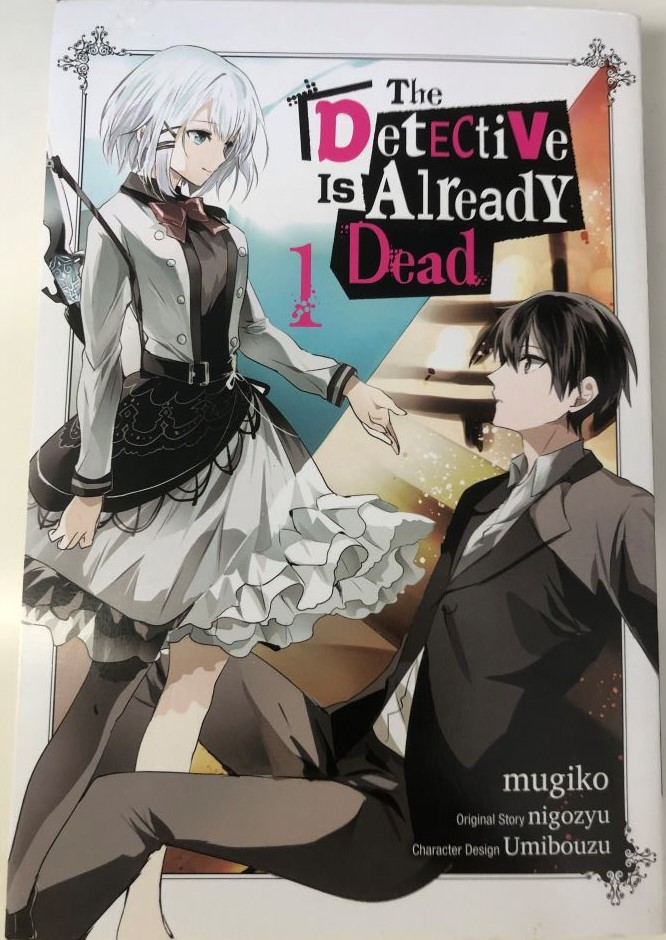

  <h1 class="col align-self-center">The Detective is Already Dead Volume 1</h1>
  

    
  
        

            

            <h2 class="accordion-header" id="headingOne">
                <button class="accordion-button" 
                    type="button" 
                    data-bs-toggle="collapse" 
                    data-bs-target="#collapseOne" 
                    aria-expanded="true" 
                    aria-controls="collapseOne">
                    Introduction
                </button>
            </h2>
                

                    

                    This is my review of Volume 1 of The Detective is Already Dead. Don't worry, I am not stopping the reviews of Nisekoi, as this is an April Fools special. When I started this blog, I decided that on 1st April I would upload a review of a series in which I do not own a copy of every released volume in English, whether that being because I didn't like the series and I dropped it, or I don't have every volume that has been released in English as they are expensive and/or hard to find. This falls into the former category.
                    

                

            

            

            <h2 class="accordion-header" id="headingTwo">
                <button class="accordion-button collapsed" 
                type="button" 
                data-bs-toggle="collapse" 
                data-bs-target="#collapseTwo" 
                aria-expanded="false" 
                aria-controls="collapseTwo">
                Episode 0: An Encounter with a Detective
                </button>
                </h2>
                

                    

                    The story begins in an aeroplane where there is a call for a detective and we are introduced to the main protagonist (and narrator) Kimihiko Kimizuka, who has a gift for being in the same places as crimes like a male teen Jessica Fletcher. Luckily there is a detective on the plane and her name is Siesta (not her real name) and she enlists Kimihiko as an assistant. The go on amazing adventures for 3 years and form a close enough bond to banter with each other, but Siesta dies. We pick up 4 years after the events at the start of the episode and Kimihiko is now your typical, 18 year old, Japanese high school student and he is ok with that.
                    

                

            

            

            <h2 class="accordion-header" id="headingThree">
                <button class="accordion-button collapsed" 
                type="button" 
                data-bs-toggle="collapse" 
                data-bs-target="#collapseThree" 
                aria-expanded="false" 
                aria-controls="collapseThree">
                Episode 1: The Detective Is Out
                </button>
                </h2>
                

                    

                   The episode begins with a teen girl walking into Kimihiko’s classroom, where he sleeping, asking if he is the great detective Kimihiko Kimizuka. The word detective triggers some bad memories for him, so he tries to dismiss the girl and leave, but she stops him by sticking her hand down his throat and threatening to touch his uvula. Kimihiko relents and begins crying, so the girl pulls his face into her chest and Kimihiko notices familiar sound. He pulls away and tells the girl not to pull that stunt or one similar to it again with strange guys she doesn’t know. The girl introduces herself as Nagisa Natsunagi and extends her hand to Kimihiko, who asks her to wash her hand. Nagisa demands that Kimihiko apologies for getting saliva on her hand (she chose to stick her hand in his mouth) as when you annoy somebody, you should apologise to them. Nagisa wants to use the services of the ace detective Kimihiko to find someone, but he corrects her by saying he isn’t even a detective let alone an ace one. Nagisa disagrees and provides newspaper stories detailing the recent crimes Kimihiko has solved such as: bag snatching, billing fraud and lost pets. Kimihiko has far more humble view of those incidents but Nagisa still disagrees, arguing that the newspaper articles are evidence for the objective fact that he is a detective and probably an ace one at that. Kimihiko agrees to help her as an assistant; not because she convinced him, but because she remind him of someone. 
                   Nagisa wants Kimihiko to find out who is the person she is looking for - overarching story for this series everyone.
                    

                

            

            

            <h2 class="accordion-header" id="headingFour">
                <button class="accordion-button collapsed" 
                type="button" 
                data-bs-toggle="collapse" 
                data-bs-target="#collapseFour" 
                aria-expanded="false" 
                aria-controls="collapseFour">
                Episode 2: Whose Heart Is This?
                </button>
                </h2>
                

                    

                   They further discuss Nagisa’s request in a cafe, where she explains that for the past year, randomly she will suddenly want to meet someone but doesn’t know who that person is, but will be from now on as X. About a year ago she got a heart transplant and after the surgery she has been getting these desires to meet X. Kimihiko believes that it is some form of memory transference which is where people, who have had transplants, behaviours change to be more similar to their donors and in this case, Nagisa’s donor wanted to meet X and that desire has been transferred to her. Kimihiko considers the matter sorted, but Nagisa disagrees as while the desire is her donors, she wants to meets X to ease her heart (literally?) and he relents and agrees to help. 
                   The next day, they meet up and Kimihiko takes Nagisa somewhere they can do some background research on Nagisa’s donor.
                    

                

            

            

            <h2 class="accordion-header" id="headingFive">
                <button class="accordion-button collapsed" 
                type="button" 
                data-bs-toggle="collapse" 
                data-bs-target="#collapseFive" 
                aria-expanded="false" 
                aria-controls="collapseFive">
                Episode 3: I'll Blow Your Head Off 
                </button>
                </h2>
                

                    

                    Kimihiko takes Nagisa to a police station as he knows a high-ranking officer there: Lieutenant Fuubi Kase. Fuubi is suspicious about Kimihiko as he is the first on the scene for 70% of all crime in the city and first met 5/6 years ago when she was still a beat officer. The 2 begin to reminisce, which annoys Nagisa who takes her frustrations out on Kimihiko. This refocuses him and he explains that they are here to find the donor because: 1: finding people is a (technically) a job for the police, 2: for donor to be declared brain-dead (thus suitable for organ removal) police must be present, 3: all brain deaths must reported to First Investigation Division of the National Police Agency’s Criminal Affairs Bureau, 4: all autopsies must be performed under the supervision of the local chief of police, and 5: he is asking Fuubi, not the police, as she is different from other officers. Fuubi can’t help him as releasing such information is too risky for career, but she is going to the ‘big house’ to see someone who has excellent hearing and they are free to tag along. 
                    They arrive at the 'big house' and Nagisa is confused that is a prison and not a mansion or a big house. After explaining what 'big house' means, they head to a cell which houses someone who gave up being human and is known as Bat, who knows Kimihiko as he and Siesta brought him to justice. They have 20 minutes to talk to him, so plenty of time.
                    

                

            

            

            <h2 class="accordion-header" id="headingSix">
                <button class="accordion-button collapsed" 
                type="button" 
                data-bs-toggle="collapse" 
                data-bs-target="#collapseSix" 
                aria-expanded="false" 
                aria-controls="collapseSix">
                Episode 4: Heart, Bat
                </button>
                </h2>
                

                    

                    Kimihiko introduces Nagisa and explains their reason for visiting. Nagisa has doubts about Bat's usefulness and she communicates this to Kimihiko by whispering, which Bat can easily pick up on, as his hearing is so good he can hear a conversation from about 100km away. This makes Bat a 'pseudohuman', but in exchange for his abnormal hearing he is blind (like a bat). The plan is for Bat to listen to Nagisa's heartbeat and he'll check it against his heart database (think Sherlock Holmes's mind palace, but full of clips of heartbeats). However, Bat is in talkative mood as he doesn't get visitors, so wants enjoy company of other humans. Kimihiko tells him that they have a time limit, but Bat is unconcerned and is wiling to provide information to smooth things over with Fuubi. So Kimihiko begins to tell the tale how he and Bat met, which begins with the events at very start of Episode 0.
                    

                

            

            

            <h2 class="accordion-header" id="headingSeven">
                <button class="accordion-button collapsed" 
                type="button" 
                data-bs-toggle="collapse" 
                data-bs-target="#collapseSeven" 
                aria-expanded="false" 
                aria-controls="collapseSeven">
                Episode 5: The Detective on the Plane
                </button>
                </h2>
                

                    

                    Past Kimihiko stunned by the beauty of Siesta and asks what her name is. She tells him and that it is a code name. She then asks what Kimihiko's names is, which he dutifully provides and she decides to call him Kimi as a nickname or as a way of saying You (Kimi can be read as you in Japanese); you decide. The 2 are taken to the cockpit where they meet Bat. Kimihiko is disgusted at the way Bat talks to them as well as the way he looks at them. Bat wants them to deduce why he has hijacked a flight in distant (to him) foreign country and if they guess wrong or take too long then he snaps the pilot's neck, dooming everyone on board including himself. Siesta points out the danger he is about to put himself in and hes doesn't care what happens as he is so incredibly bored right now. Siesta then deduces that Bat has hijacked the plane because he is bored - only a master detective could have worked this out!
                    

                

            

            

            <h2 class="accordion-header" id="headingEight">
                <button class="accordion-button collapsed" 
                type="button" 
                data-bs-toggle="collapse" 
                data-bs-target="#collapseEight" 
                aria-expanded="false" 
                aria-controls="collapseEight">
                Conclusion
                </button>
                </h2>
                

                    

                    The person that Nagisa's donor is looking to meet is probably Kimihiko as the donor is most likely Siesta - Spoilers if this is true, I haven't checked. The reason being that it narratively makes sense as Kimihiko obviously was in love with Siesta and was heart-broken when she died, so needs one last goodbye to get over it. This twist was so obvious to me and the fact that the most positive emotion I had towards any of the characters was apathy, I dropped the series. I am selling my copy of The Detective is Already Dead Volume 1, so if you wish to buy it, here is the link to its item page on my ebay page: <a href="https://www.ebay.co.uk/itm/236032250522">https://www.ebay.co.uk/itm/236032250522</a>.
                    

                

            

        

    

    

    

  

