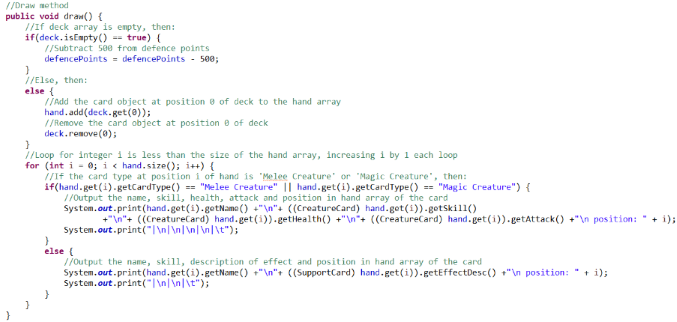
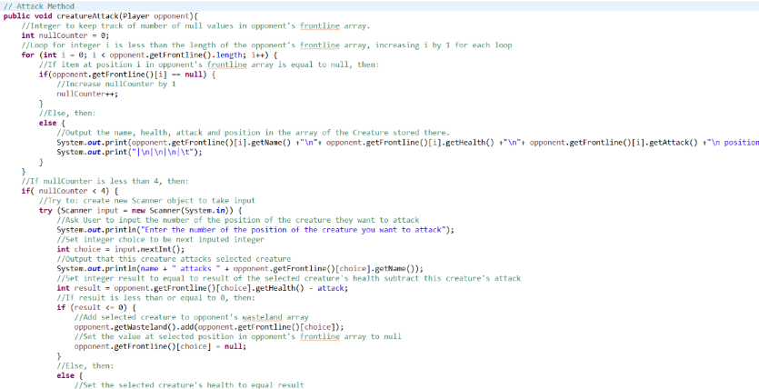
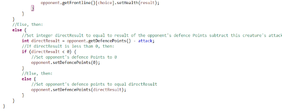

  <h1 class="col align-self-center">Stay Classy</h1>
  

    

    Hello all! 
    With this first update, I thought I'd let you know what I have done so far as well as any changes that have been made compared to the Design Document. As always, the entire project is available at this GitHub repository: <a href="https://github.com/CulverT01/cardgameplayer">https://github.com/CulverT01/cardgameplayer</a>
    

  

  

    <h2 class="row">Updates</h2>
    
 
    I have programmed the Player, Card, Creature Card and Support Card classes with all of the attributes and behaviours listed in the design document along with other necessary methods such as Constructors and Getters and Setters. I have commented all behaviour methods that I have written and will show a few examples below.  
    I have yet to test to test these methods, but I plan to do this next time along with the programming of a few Support Card classes; an explanation as to why will be given in the changes section. 
    
    
    
    

  

  

    <h2 class="row">Changes and Clarifications</h2>
    
 
    As mentioned in the Updates section, there is a clarification to how Support Cards will be implemented. As each Support Card will have their own effect, each individual card will need to be its own individual class rather than with Creature Cards, which are individual objects of the same class. For some sense of commonality between each Support Card class, they will inherit from an abstract class called SupportCard, which itself inherits from the Card class, and it will have the attribute effectDesc (description of the card's effect) which is a string and an abstract method effect as its behaviour. The Getter and Setter for the effectDesc will be part of the SupportCard class. 
    Another clarification is that all behaviour methods are public void methods meaning they can be accessed by any other class and will not return any value, the exception being previously mentioned effect method. All Attributes, with the exception of the name attribute in the Card class, are private meaning they can only be accessed by methods within the class itself. The previously mentioned name attribute is protected because the creatureAttack method in the Creature Card class requires access to the attribute. 
    The changes relate to the flowcharts particularly to Player's draw from deck method and Creature Card's attack method. The 'Set Plan Stage to equal True' process will be omitted and implemented into the Runner's game begin method; while the attack method will include a decision on whether or not the defence points of the opposing player are less than the attack of the creature, and if they are, then the defence points are set to 0 and the method ends, else then the process 'Subtract creature's attack from opponent's defence points' is run and then the method ends. Updated flowcharts will be found in the V1_1 of the design Document.
    

  

