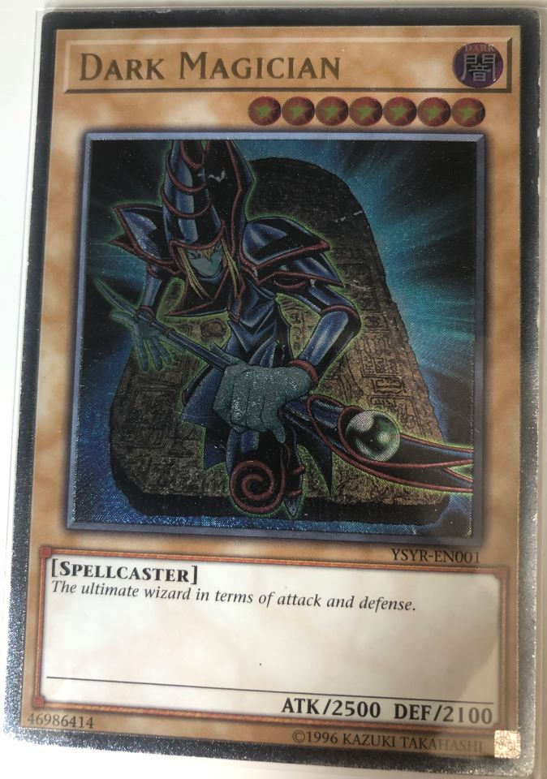
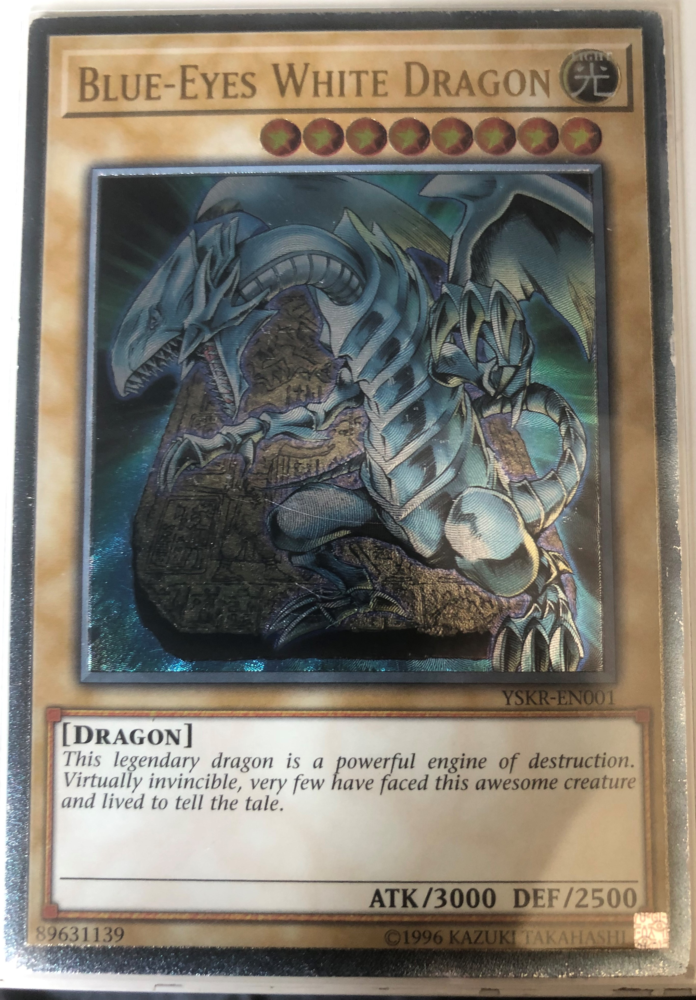
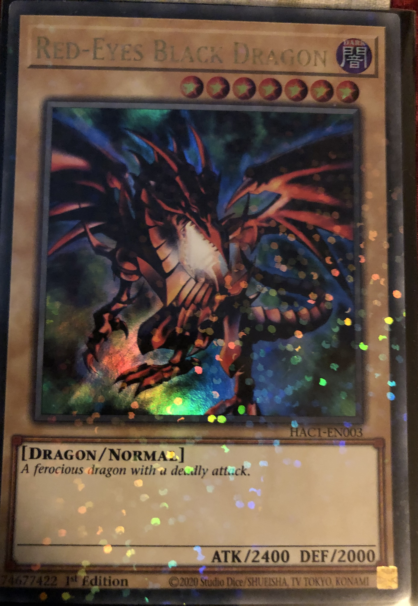

  <h1 class="col align-self-center">Pulling the website by its Bootstraps</h1>
  

    

    This post evidences the usage of Bootstrap across the website. Bootstrap is a framework that's used to give styling to your website as well as allow it be dynamic with various components like the Carousel shown below. The cards that are shown are from Yu-Gi-Oh! trading card game that I own.
    

  

  

    

      

        

          <button type="button" data-bs-target="#carouselCaptions" data-bs-slide-to="0" class="active" aria-current="true" aria-label="Slide 1"></button>
          <button type="button" data-bs-target="#carouselCaptions" data-bs-slide-to="1" aria-label="Slide 2"></button>
          <button type="button" data-bs-target="#carouselCaptions" data-bs-slide-to="2" aria-label="Slide 3"></button>
        

        

          

            

            

              <h5 class="text-info">Dark Magician</h5>
              
The ultimate wizard in terms of attack and defence.

            

          

          

            

            

              <h5 class="text-info">Blue-Eyes White Dragon</h5>
              
This legendary dragon is a powerful engine of destruction.  
              Virtually invincible, very few have faced this awesome creature and lived to tell the tale.

            

          

          

            

            

              <h5 class="text-info">Red-Eyes Black Dragon</h5>
              
A ferocious dragon with a deadly attack.

            

          

        

        <button class="carousel-control-prev" type="button" data-bs-target="#carouselCaptions" data-bs-slide="prev">
          
          Previous
        </button>
        <button class="carousel-control-next" type="button" data-bs-target="#carouselCaptions" data-bs-slide="next">
          
          Next
        </button>
      

    

