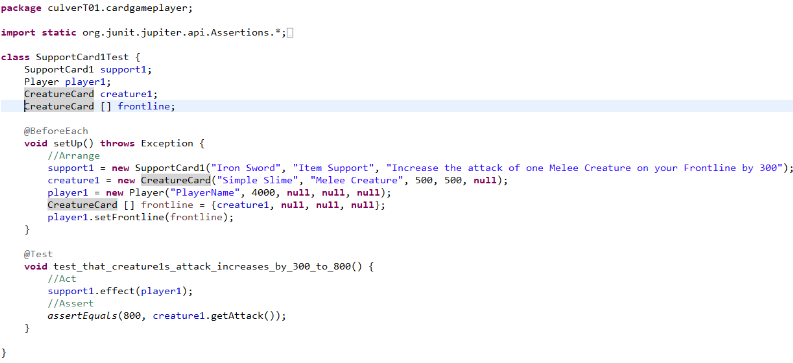
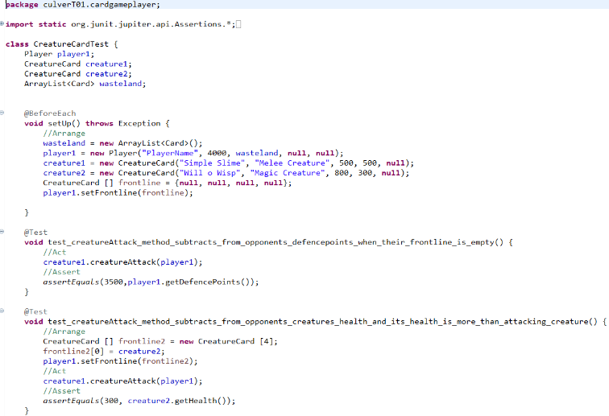

  <h1 class="col align-self-center">Testing! Attention Please</h1>
  

    

    Hello all! 
    This is the second update to the Card Game Player Project and this time I've been focussing on testing the behaviour methods I created during the last update. Admittedly, I should've made the tests before making the behaviour methods and editing them to make sure the methods pass and work as intended, because this in line with TDD (Testing Driven Development), which is I believe is pretty much standard for all programming jobs. 
    As to why I didn't do TDD, I wasn't massively sure on the exact direction the methods were going to take. For example, the original design for the draw behaviour method for the Player class, had it returning a boolean value to indicate that the next stage of the turn could begin and that would obviously be a value to be used in a test as its parameter. However, because I decide to make that and all other behaviour methods so far void methods, thus I would need a value that can be checked against another value that's been changed as the way of testing instead. For future methods, I will follow TDD in their creation. 
    As always, the entire project is available at this GitHub repository: <a href="https://github.com/CulverT01/cardgameplayer">https://github.com/CulverT01/cardgameplayer</a>
    

  

  

    <h2 class="row">Updates</h2>
    
 
    I have tested the Player, CreatureCard, SupportCard1 and SupportCard2 classes' behaviour methods with Card and SupportCard classes not being tested as they have no methods apart from Getters and Setters. All tests have passed, with the alterations in order to make sure those tests pass being listed in the Changes and Clarifications section 
     
     
     
    

  

  

    <h2 class="row">Changes and Clarifications</h2>
    
 
    As mentioned in the Updates section, here are the changes made to make sure the tests passed. Also, the SupportCard behaviour method effect takes a Player object as an argument as well as the player class' playCardFromHand behaviour method as that calls SupportCard's effect method.
    

    <ul class="col-8">
      <li>The removal of the try-with resources surrounding the Scanner object, as they would only allow one input per running of a program, which meant if a test class had multiple tests that called the same method which had a Scanner object, then only the first test with that method in would run successfully as the second would trigger a  NoSuchElementException error. This means the input stream is never closed, which I feel is bad programming practice and the Scanner is the ideal input stream for the methods it is used in.
      </li>
      <li>
      The addition of an if statement within for-loops, that are used to display or find the first instance of CreatureCard object in the frontline array, that allow the method to deal with null values within said array. Within these for-loops there was already an if statement and these have now changed to else-if statements. This done because, NullPointerException errors would occur when the methods containing these for-loops were tested. There is probably code out there which can deal with NullPointerExceptions, but the solution I have now works and that is enough.
      </li>
    </ul> 
  

