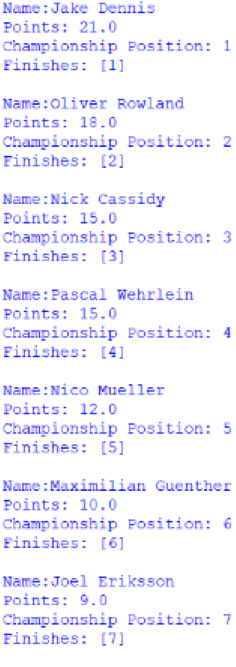
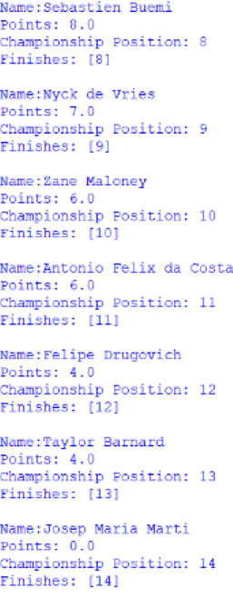
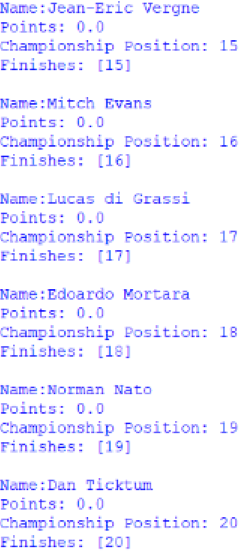
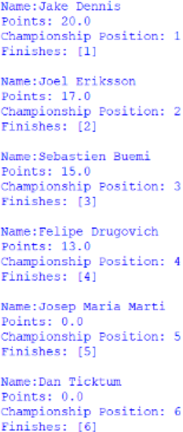
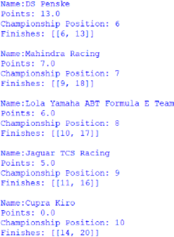
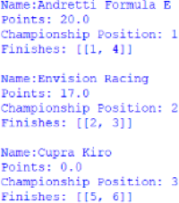
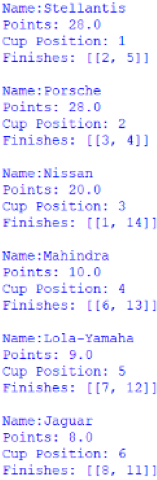

  <h1 class="col align-self-center">2025 Google Cloud Sao Paulo ePrix Review</h1>
  

    

   Hello to all reading this, as this is my first review of a motorsport event so there may be changes made as I get better at this. The structure of the review will go like this: I have a paragraph on Qualifying, before paragraphs on the race itself, the race with specificity on the Customer Drivers class, the Nelson Piquet Jr Trophy class, the Teams Championship, the Customer Teams Championship, and the Manufacturers Cup. For the overall championships, I will also mention any differences between the standings (the usual differences in points and in positions) and I will include the standard images of the standings for each championship under the alternative points format. This will be the last post until after the next Formula E race as I need to take some time off to sort some technical aspects out regarding the website. 
   The next Formula E race will be the 2026 Hankook Mexico City ePrix on 10th January 2026 at 20:00 UTC and you can find out where to watch it <a href="https://www.fiaformulae.com/en/ways-to-watch">here</a>. 
    

  

  

    <h2 class="row">Qualifying</h2>
    

    There is a slight change to qualifying this year compared to previous years as now the Group stage of qualifying is now 10 minutes rather than 12 as well as the removal of the need to set a lap time within the first half of their group's time on track is removed as well. Group A went out first and consisted of: Oliver Rowland, Josep Maria Marti, Max Guenther, Antonio Felix da Costa, Joel Eriksson, Zane Maloney, Jean-Eric Vergne, Jake Dennis, Edoardo Mortara, Nico Mueller. It was a clean session, with everyone but Zane (Driveshaft issues that had plagued his team throughout free practice came up again) getting proper laps in, but the shock from qualifying was that defending champion Oliver missed the duel stage by finishing 5th in the group and he had 3 place grid penalty from a crash he had with Nico at the final race of last season in London. The 4 from the group that would move onto the Duel stage were: Antonio, Jean-Eric, Edoardo, and Jake. 
    Group B went next and consisted of Mitch Evans, Lucas Di Grassi, Sebastien Buemi, Nyck de Vries, Norman Nato, Felipe Drugovich, Dan Ticktum, Nick Cassidy, Taylor Barnard, and Pascal Wehrlein. This session isn't as clean as the first, because with about 2:54 left in the session, Felipe clips the barrier on the inside of turn 4 and breaks his front right suspension. Also, under the subsequent red flag to retrieve Felipe's stricken car, Lucas speeds under those red flag conditions and picks up a 3 place grid penalty. He would also not return after the red flag as he too suffered from driveshaft issues like his teammate. The 4 that made it into Duel stage from group B were: Norman, Pascal, Nyck, and Dan. 
    The 1st Quarter-Final was between Jean-Eric and Edoardo, with the latter winning and the 2nd was between Antonio and Jake with, again, the latter winning and moving onto Semi-Final 1. Quarter-Final 3 was between Pascal and Nyck, which saw Pascal advance to Semi-final 2 and the final Quarter-Final was between Norman and Dan which saw Dan moving on to the Semi-Finals. Semi-Final 1 was between Edoardo and Jake, which Jake won and Semi-Final 2 was between Pascal and Dan, with the former winning. The Final saw Pascal winning and thus taking pole, however, Pascal had spun his wheels in the pit-lane prior to the Semi-Final Duels which is now against the rules (Antonio had fallen foul of this in Free Practice but got away with a reprimand) and copped a 3 place grid penalty and Jake would start from 1st grid spot.
    

  

  

    <h2 class="row">Race</h2>
    <h3 class="row">Overall Drivers' Championship</h3>
    
 
    Jake Dennis wins the race from Oliver Rowland in 2nd and Nick Cassidy in 3rd. He becomes the first driver to win the Sao Paulo from the front row with next highest starting winner being Mitch Evans in Season 9 with 3rd. The race was standard 'peloton' style race with a lot of race leaders as well as, for most of the race, drivers leading no more than 2 consecutive laps. That said, this is more 'peloton' as we set an event record of 8 different race leaders, double what was managed in the first edition in Season 9 (Season 10 and 11 only have 5 apiece). The recipients for the fastest lap point are different as Taylor Barnard takes it under the alternative format, but as he finishes 13th, the fastest lap point in real life goes to Oliver instead. 
    There are few incidents across the race, as at the start Nyck de Vries out-brakes himself and punctures Dan Ticktum's left rear tyre and makes contact with his teammate, taking both off-track. Edoardo Mortara (Nyck's teammate) fails to properly rejoin the race track as, if you go off at turn 1 you are supposed to come to a complete stop and then rejoin by going through 2 bollards, so he picks up a 5 second penalty, which is later rescinded because he was forced off. This is a moot point as on lap 23, Lucas Di Grassi collides with Edoardo on the exit of turn 5, putting the latter out of the race while former retires under subsequent safety car. Lucas is found to be at fault for the accident and will serve a 5 place grid drop for his next race. The Mahindra Racing drivers are not the only teammates to collide as the 2 Nissan Formula E Team drivers collide on the exit of turn 6 on lap 17, with Norman Nato picking up a rear right puncture and retires upon exiting the pits in the run-off for turn 1. 
    Despite having their driver hitting each other as well as having 1 of them retire, neither have the worst weekend on the grid as that goes to Cupra Kiro, as after his puncture, Dan Ticktum picks up 2 drive-through penalties: 1 for wheelspin in the pit-lane and the other was for his team working in the car while it's status is 'ready to move', meaning the car is live and can immediately drive off. This poses a risk to the mechanics as the car could suddenly set off and run them over or they receive a possible deadly shock (Formula E powertrains when properly active produce a voltage over 60 volts, which can be enough to kill) and in Kiro's defence, Mahindra are also caught out by this as well. 
    The other Kiro driver, Josep Maria 'Pepe' Marti, crashes under Full Course Yellow or FCY (called after Mitch Evans and Sebastien Buemi collide, resulting in Mitch to end up in the barriers at turn 10) after failing to properly slow down for it and vaults over Nico Mueller's and Antonio Felix da Costa's cars with the latter picking up the most damage. Pepe barrel-rolls down the straight between turns 6 and 7 and this accident only occurs due to difference in procedure compared to what normally happens under Virtual Safety Car (VSC) in Formula 2 (Pepe's most recent series prior to Formula E). In Formula 2, when a VSC is called, drivers immediately slow down, while for a FCY, a countdown is broadcasted to all driver by the race director and you are supposed to start slowing down from the beginning of the countdown, which the vastly more experienced Antonio and Nico did. Pepe will start at the back of the grid for the next, regardless of where he qualifies. 
    In Pepe's defence, he is not the only driver to fall foul of FCY rules as fellow rookie Felipe Drugovich picks up 2 5-second penalties (1 is converted to a 3 place grid drop for his next race) for speeding under FCY and overtaking under FCY as well as 2-time (in real life) Formula E champion Jean-Eric Vergne, who also speeds under FCY. Jean-Eric retires under the red flag in the pits, (called for Pepe's incident) due to 'collision damage', but is classified behind him (don't ask). 
    2 drivers have less points under the alternative format compared to real life, Jake and Oliver, as the former has 21 points under the alternative format compared to 25 in real life and the latter has 18 under the alternative format compared to 19 in real life. Nick, Pascal Wehrlein, and all drivers who finished 14th or lower match their points totals across both formats and the driver who has the most points compared to real life is Antonio, who has 6 more points under the alternative format compared to real life. The standings are the same across both formats as it is quite hard to have a difference after 1 race. 
    Below are the overall Drivers' Championship standings:
     
     
    
    

    <h3 class="row">Customer Trophy for Drivers</h3>
    

    The class is won by overall race winner Jake Dennis with 2nd in class going to Joel Eriksson and 3rd to Sebastien Buemi. Felipe Drugovich initially finishes 2nd in class, but drops to 4th the after 5 second time penalty for speeding under Full Course Yellow. For the majority of the race, Jake leads the class and only initially stops on lap 12, as he is overtaken by Sebastien on the exit of turn 5, while the latter is in Attack Mode. Jake retakes the lead going into turn 1 on lap 15 and maintains it for the rest of the Prix as he is under no threat by any of his fellow competitors in the class and his teammate is only one who gets anywhere close to him. 
    Below are the Customer Trophy for Drivers standings: 
    
    

    <h3 class="row">Nelson Piquet Jr Trophy</h3>
    

    The winner of the class is Nico Muller with 2nd going to Joel Eriksson and 3rd to Zane Maloney. Felipe Drugovich had initially won the class, meaning we were at least guaranteed that Nico wouldn't sweep all the races for the trophy as: he is in the best equipment and has the most experience by far. However, that speeding under Full Course Yellow penalty sees Felipe drop to 4th in class and Nico to win it. Nico leads from the get go and only relinquishes the lead to Josep Maria Marti on lap 15 after going through Attack Mode loop, before retaking the lead on lap 17 through turn 3. He maintains this until lap 23, when taking his 2nd Attack Mode, he briefly loses the class lead to Joel Eriksson, who also is in his 2nd Attack Mode as well, but beats him into turn 4 on the same lap. He loses the class lead on the road on lap 28 as Felipe, in Attack Mode, breezes past him down the pit straight and into turn 1. 
    Below are the Nelson Piquet Jr Trophy standings: 
    
    

    <h3 class="row">Overall Teams' Championship</h3>
    

    With the win, Andretti Formula E lead the standings under both formats and are tied with Porsche Formula E Team in terms of points under both formats as well. They and Nissan Formula E Team (3rd place under both formats) are the only team to score less points under the alternative format, with the former 2 being 1 point down under the alternative format and the latter 2 points off under the alternative format. Citroen Racing Formula E Team and Cupra Kiro are the only teams to tie points totals across both formats as Kiro cars retire (one more spectacularly than the other) so score 0 points under both formats and Citroen's only finishing car finishes 3rd, scores the same amount of points across both formats. Everyone else scores more points, which benefits Envision Racing as they score 17 points and thus tie with Nissan, so are ahead of Citroen under the alternative format to be 4th instead of 5th like they are in real life. There are no other changes between the 2 formats in terms of the standings. Envision gained most points under the alternative format compared to real life as they gain 7 points over their real life total. 
    Below are the overall Teams' Championship standings: 
     
    
    

    <h3 class="row">Customer Teams' Championship </h3>
    

    As Jake Dennis won the Customer Driver class, Andretti Formula E lead the class with 20 points over Envision Racing who have 17. Before Felipe's Drugovich's penalty, Envision only had 15, as Andretti claimed a class 1-2, so are now 2 points closer which doesn't seem like much, but remember that last year 3 points (the current gap) separated NEOM McLaren Formula E Team (1st) from Andretti (4th), so those points that Envision gained could matter come London. Also, don't rule Kiro out of title contention already, as Andretti had a woeful start to Season 11 in the Customer class and almost won the teams title at the final race. 
    Below are the Customer Teams' Championship standings: 
    
    

    <h3 class="row">Manufacturers' Cup</h3>
    

    Stellantis lead the standings in Manufacturers' Cup under the alternative format with points total of 28 over Porsche, who tie with them, but lose on countback as Stellantis have a 2nd to Porsche's 3rd as their best result. 3rd goes to Nissan who have 20 points under the alternative format. Only Porsche and Jaguar have less points under the alternative format as their best performing (or Jaguar's case best 2) driver is a customer driver, who cannot score points for a manufacturer under the alternative format. This means there are changes between the standings, with only Nissan maintaining the same standing position across both formats. Porsche and Stellantis swap as Porsche have 37 points in real life to Stellantis' 25 in real life and Jaguar drop to 6th and push Mahindra and Lola-Yamaha up a place to finish 4th and 5th respectively. Lola has the biggest positive points difference between their alternative points total and their real life total at 7 (9 point under the alternative format and 2 in real life). 
    Below are the Manufacturers' Cup standings: 
    
    

  

