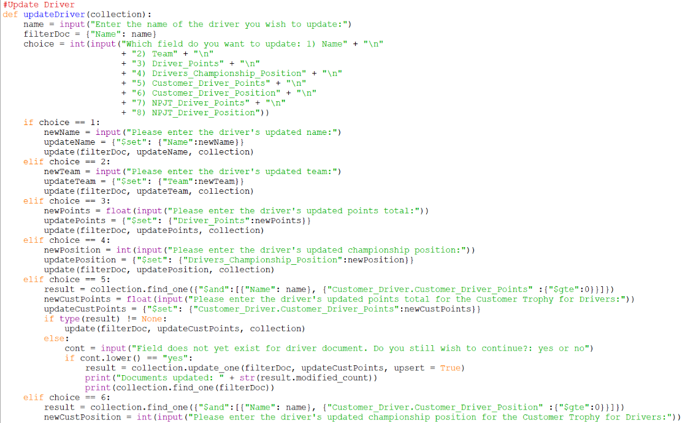
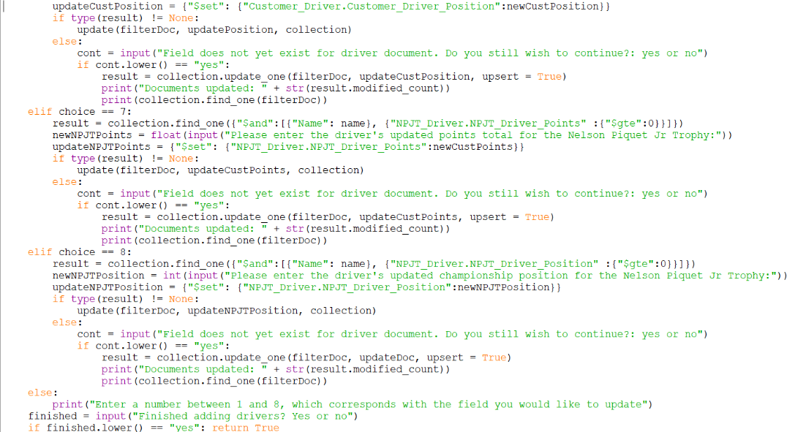
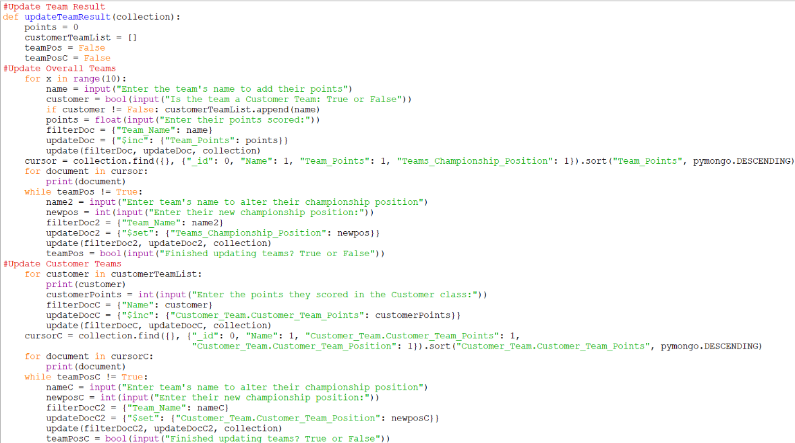

  <h1 class="col align-self-center">And We Go Green</h1>
  

    

    This is the second update to my Alternative Formula E Points Format project. So far I have made the functions that allow for updates be made to documents, with functions dedicated to updating the various points and positions of the drivers, teams and manufacturers. I have also created a new file called afepf_functions.py to store all of the functions in, so afepf_admin_program.py is less cluttered and time is saved programming the general user program. 
    As always, all files and documents are found in the GitHub repository: <a href="https://github.com/CulverT01/altfepointsformat">https://github.com/CulverT01/altfepointsformat</a> 
    Please note that I have removed the username and password for the database from the admin program in the interest of security.
    

  

  

    <h2 class="row">Updates</h2>
    
 
    The updateDriver, updateTeam, and updateManufacturer functions allow the user to select a field and a document to update and will stop when the user wishes to no longer update to a collection. The updateDriver function is displayed below as an example. 
    
   
    

    

    The updateDriverResult, updateTeamResult, and updateManufacturerResult functions allow the user update the points and championship position a driver or team or manufacturer is entered in. The program uses a for loop to go through every competitor and adds the points they have earned in a championship, before using a while loop to allow the user to update the competitor's championship position as well. 
    The updateTeamResult is displayed below as an example. 
   
    

  

  

    <h2 class="row">Changes and Clarifications</h2>
    

    The creation of afepf_functions.py was done so afepf_admin_program.py could be more navigable when I come back to add code to allow for read, update, and delete operations. It also serves a 2nd purpose in that I only have to code read-operation functions once, as that is the only operation general users will be able to do. The functions are made available by importing afepf_functions.py module into the admin program and giving it an alias of afepf to reduce the amount of words needed to complete the program. All subsequent functions will be programmed in this file and the create operation functions documented in the last update have also been moved into the file, with an alteration that they return a boolean value of True if finished is equal to "yes" and x is set equal the returned value of these functions.
    

  

