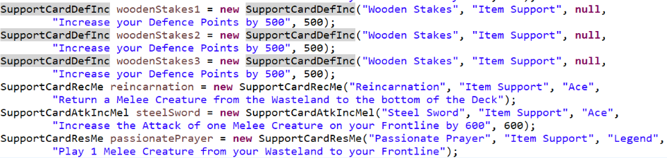

  <h1 class="col align-self-center">Carrot Juice, Carrot Juice, Carrot Juice</h1>
  

    

    This is the sixth update to the Card Game Player Project and the final one for now. I may return to this project a later point as there are changes I would make to make it more user-friendly, so for now it's the end, but the moment has been prepared for. 
    I have created 2 decks that are 30 cards big and adhere to the game's rules (2 Ace Creatures, 1 Legend Creature, 2 Ace Support Cards, 1 Legend Support Card) with a full breakdown of the decks in the updates section. I have also reconfigured all loops that display card details and have also edited the battle stage method in the App class. I think possible future changes would be to allow decks to be edited before a game and to be saved and stored somewhere, as well as having 2 separate displays so your opponent can't see your hand. 
    As always, the entire project is available at this GitHub repository: <a href="https://github.com/CulverT01/cardgameplayer">https://github.com/CulverT01/cardgameplayer</a>
    

  

  

    <h2 class="row">Updates</h2>
    
 
    The decks are built in a separate class called DeckLoad and each deck has their own static ArrayList method which is called when the player object is constructed. Each deck has 15 Creature Cards and 15 Support Cards, with player 1's deck (set from the loadDeck1 method) containing Melee Creatures and Item Support Cards, while player 2's deck (set from the loadDeck2 method) uses only Magic Creatures and Magic Support Cards. 
    Player 1's deck is shown below in these images. 
     
    
    

    

    Player 2's deck is shown below in these images. 
     
    
    
 
  

  

    <h2 class="row">Changes and Clarifications</h2>
    

    The loops that display card details have all been all reconfigured because the intention was to have the cards displayed in a row horizontally, but the way I had still put them down  vertically. The assumption was to fix it at some point, but it became less and less of a priority until it was abandoned and went for a more vertical display, although I might try for a more horizontal display in the future.  
    The battleStage method was changed as originally the method had the Creatures attack in the order they are stored in the frontline array, but if you wanted a certain Creature to attack later (as it had a higher attack stat and could inflict more damage at your opponent directly), then the only way was to have it to be added to the frontline array towards the back, which is not always possible, given the fact that Creature Cards are always to added to the first available position in the array, so allowing the player to choose the order in which Creatures attack is more player friendly. 
    The new battleStage method is shown below. 
     
    
    

  

